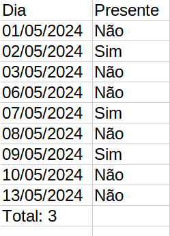
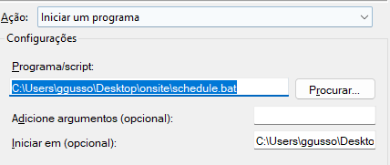

# onsite

Script para verificar se você foi para a empresa 👍

Na pasta escolhida, um arquivo `.csv` é salvo com o padrão `mês-ano.csv` para cada novo mês.

Você pode escolher entre marcar as entradas manualmente (rodando `onsite -y` pelo prompt de comando) ou deixar que ele verifique a conexão com o Wifi da empresa todos os dias pelo scheduler do Windows.

## Como usar

1. Baixe o zip;
2. Instale as dependências com `npm i`;
3. (Opcional) Configure a pasta onde você quer que os arquivos sejam salvos em `bin/config.js`;

### Manualmente

1. Rode `npm link` para tornar o script acessível pelo prompt de comando do Windows.
2. Todos os dias em que você for para a empresa, abra o cmd (ou o painel de execução do Windows, `CTRL+R`) e digite `onsite -y`.
   A pasta destino padrão do CSV é `Documentos/onsite`.

Comandos:
 
`onsite` abre a CLI.
 
`-y` ou `-n` como argumentos pula o diálogo e adiciona o registro automaticamente (y = sim, fui para a empresa; n = não).

### Automaticamente

1. Configure o nome do Wifi da empresa em `bin/config.js`;
2. Crie uma nova task no Scheduler do windows:

     1. Execute `taskschd.msc`;
     2. Ação -> criar tarefa;
     3. Crie um disparador para todos os dias úteis da semana, pela manhã;
     4. Na aba Ações, coloque o caminho para o bat disponibilizado no campo "Programa/script";
     5. Coloque o caminho para a **pasta** do bat no campo "Iniciar em".

     

3. Todos os dias, no horário configurado, o script vai ser executado. Se o wifi da empresa for reconhecido, o dado será salvo automaticamente. Caso contrário, um diálogo será aberto pedindo para confirmar ou negar a sua presença.
